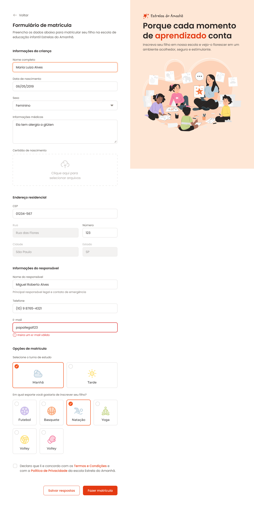

  Formulário de matrícula

Projeto de um Formulário de matrícula desenvolvido durante as aulas sobre Formulários na Rocketseat.

  <a href="#-tecnologias">Tecnologias</a>&nbsp;&nbsp;&nbsp;|&nbsp;&nbsp;&nbsp;
  <a href="#-projeto">Projeto</a>&nbsp;&nbsp;&nbsp;|&nbsp;&nbsp;&nbsp;
  <a href="#memo-licença">Licença</a>

 

  

## 🚀 Tecnologias

Esse projeto foi desenvolvido com as seguintes tecnologias:

- HTML
- CSS

## Projeto

Nesse projeto iremos desenvolver um Formulário de matrícula para uma escola de educação infantil. Vamos trabalhar com diversos tipos de input além de rever e treinar bastante o nosso CSS.